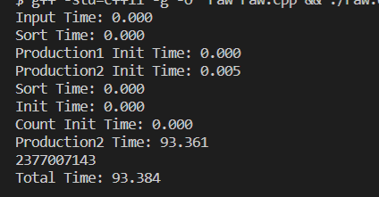
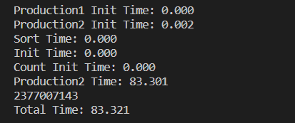
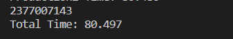
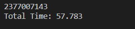

# 实验报告

## 常规串行优化

首先进行串行优化

1. 将所有的`i++`改为`++i`
2. 将初始化操作在结构体内部执行

发现大部分时间都在一个`for`循环中

3. 将`for`循环中`subTreeBuf`改为全局静态
4. 变量声明都弄成共享变量。

优化了10s

5. 把所有的`int`定义改为共享的

优化了3s

6. 开启一堆编译器优化

优化了20s

